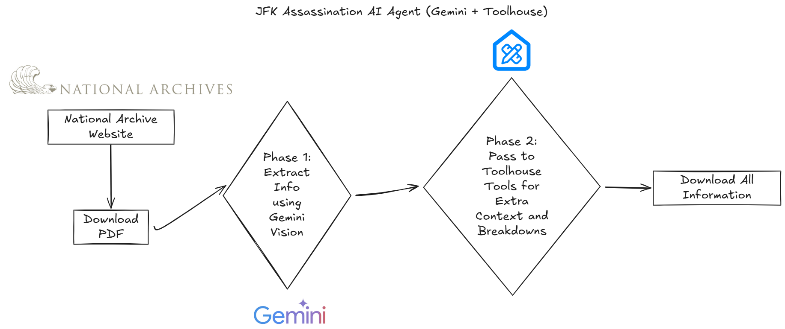

# Building a JFK Files Analyzer with Streamlit, Gemini Vision, and Toolhouse

This project demonstrates how to build an advanced document analysis application that helps researchers analyze declassified JFK assassination files using Google's Gemini Vision models and Toolhouse for enhanced historical context.

> 👋 This application combines multimodal AI (vision + text) with Toolhouse's research capabilities to provide deeper insights into historical documents.

## Demo Preview



## What This Application Does

This Streamlit application allows users to:

1. **Upload and analyze declassified JFK assassination documents** (PDF or single image)
2. **Extract key information** using Gemini Vision Models:
   - Document identification (type, classification level, date)
   - Key entities (people, organizations, locations)
   - Subject matter analysis
   - Intelligence value assessment
3. **Generate document summaries** based on page-by-page analysis
4. **Enhance analysis with historical context** using Toolhouse and Groq LLMs
5. **Create downloadable reports** for research purposes

## Tools and Technologies Used

To build this AI-powered document analyzer, we're using:

- **Streamlit**: For the web interface
- **Google Gemini 1.5**: For multimodal document analysis (vision + text)
- **PyMuPDF**: For PDF handling and rendering
- **Toolhouse + Groq**: For historical context analysis and research connections
- **Python-dotenv**: For environment variable management

## Setting Up the Project

First, ensure you have the necessary API keys set as environment variables:

```bash
export GEMINI_API_KEY="your_gemini_api_key"
export TOOLHOUSE_API_KEY="your_toolhouse_api_key"  
export GROQ_API_KEY="your_groq_api_key"            
```

## Environment Setup

Create a virtual environment and install the required dependencies:

```bash
# Create and activate virtual environment
python -m venv venv
source venv/bin/activate  # On Windows: venv\Scripts\activate

# Install dependencies
pip install -r requirements.txt
```

## Running the Application

Start the Streamlit application:

```bash
streamlit run app.py
```

## Key Features and Implementation Details

### 1. Document Processing

The application processes documents in two ways:

```python
# Process PDF files with multiple pages
def process_pdf(pdf_file, max_pages=5, prompt=DOCUMENT_ANALYSIS_PROMPT):
    # Create temporary file and process with PyMuPDF
    with tempfile.NamedTemporaryFile(delete=False, suffix='.pdf') as tmp_file:
        # Processing logic...
        
    # Analyze each page with Gemini Vision
    for page_num in range(pages_to_analyze):
        # Render page to image
        pix = page.get_pixmap(matrix=fitz.Matrix(2, 2))
        
        # Send to Gemini for analysis
        response = client.models.generate_content(
            model=model_choice,
            contents=[prompt, image]
        )
```

### 2. Enhanced Historical Context with Toolhouse

The application integrates with Toolhouse to provide deeper historical context:

```python
# Function to run Toolhouse analysis
def run_toolhouse_analysis(text_content):
    # Initialize Toolhouse and Groq
    th = Toolhouse(api_key=toolhouse_api_key)
    groq_client = Groq(api_key=groq_api_key)
    
    # Create prompt and send to Groq with Toolhouse tools
    messages = [{
        "role": "user",
        "content": f"""I'm reading JFK Assassination files published in the 
        National Archives website. I've noticed a document with below content..."""
    }]
    
    # First API call to get tool calls
    response = groq_client.chat.completions.create(
        model=groq_model,
        messages=messages,
        tools=th.get_tools(),
    )
    
    # Run the tools and get final response
    tool_run = th.run_tools(response)
    # Continue with processing...
```

### 3. Document Summarization

The application provides comprehensive document summaries:

```python
# Function to generate document summary
def generate_summary():
    # Combine all the analysis text
    all_analysis = "\n\n".join([f"**Page {r['page_num']}**:\n{r['analysis']}" 
                                for r in results])
    
    # Generate a summary using Gemini
    summary_prompt = SUMMARY_PROMPT_TEMPLATE.format(all_analysis=all_analysis)
    summary_response = client.models.generate_content(
        model=model_choice,
        contents=[summary_prompt]
    )
```

## User Interface

The application features a clean, intuitive interface with:

1. **Configuration sidebar** for model selection and analysis options
2. **Document upload area** with support for PDFs and images
3. **Analysis view** with side-by-side document and AI analysis
4. **Summary view** for comprehensive document overview
5. **Export options** for downloading analysis and reports

## Advanced Features

- **Custom prompts**: Users can customize the analysis prompt
- **Historical context**: Optional integration with Toolhouse for deeper research
- **Multiple model support**: Compatible with various Gemini models
- **Flexible export options**: Download analysis for individual pages or full reports

## Conclusion

This JFK Files Analyzer demonstrates how modern AI tools can be combined to create powerful research applications. By integrating Google's Gemini Vision models with Toolhouse's research capabilities, we've created a tool that helps researchers extract meaningful insights from complex historical documents.

Feel free to expand this application by adding more analysis capabilities, visualization tools, or integration with other historical databases.

## Requirements

```
streamlit==1.32.0
anthropic==0.34.1
toolhouse==1.1.2
python-dotenv==1.0.1
requests==2.32.3
google-generative-ai
PyMuPDF
Pillow
groq
```