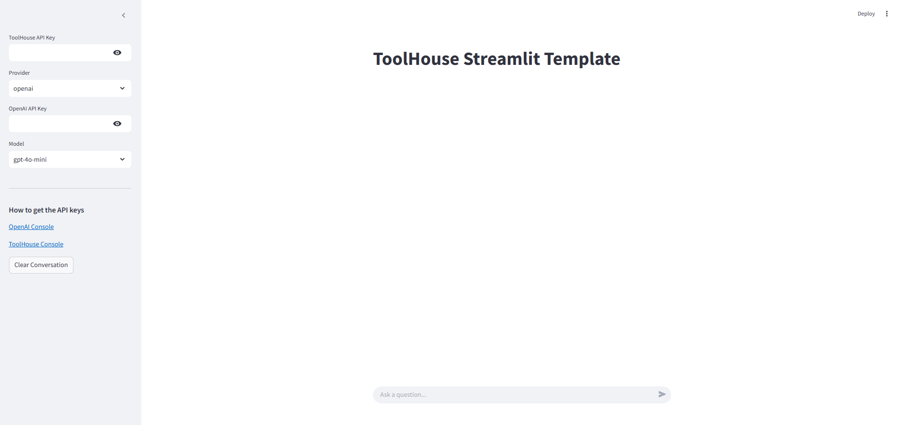

# Toolhouse Streamlit Template

A simple starter streamlit template for building applications with Toolhouse.ai.



## What it does

- Connects to Toolhouse tools
- Works with LLM of your choice (OpenAI and Anthropic models)
- Provides a chat interface for user queries
- Handles API communication and tool execution

## Quick Start

1. Clone this repository
   ```
   git clone https://github.com/yourusername/toolhouse-streamlit.git
   cd toolhouse-streamlit
   ```

2. Install dependencies
   ```
   pip install -r requirements.txt
   ```

3. Run the app
   ```
   streamlit run app.py
   ```

## Required API Keys

- **Toolhouse API Key**: Get from [Toolhouse Console](https://toolhouse.ai/settings)
- **OpenAI API Key**: Get from [OpenAI Console](https://platform.openai.com/api-keys)
- **Anthropic API Key**: Get from [Anthropic Console](https://console.anthropic.com/settings/keys)

Enter API keys in the sidebar or set them as environment variables:
```
export TOOLHOUSE_API_KEY="your-key"
export OPENAI_API_KEY="your-key"
export ANTHROPIC_KEY="your-key"
```

## Customization

- Change supported models in the provider selectbox options
- Add custom system instructions by modifying the code
- Extend with additional Streamlit components as needed

## Features

- Switch between OpenAI and Anthropic models
- Clear conversation history
- Responsive chat interface

## License

MIT